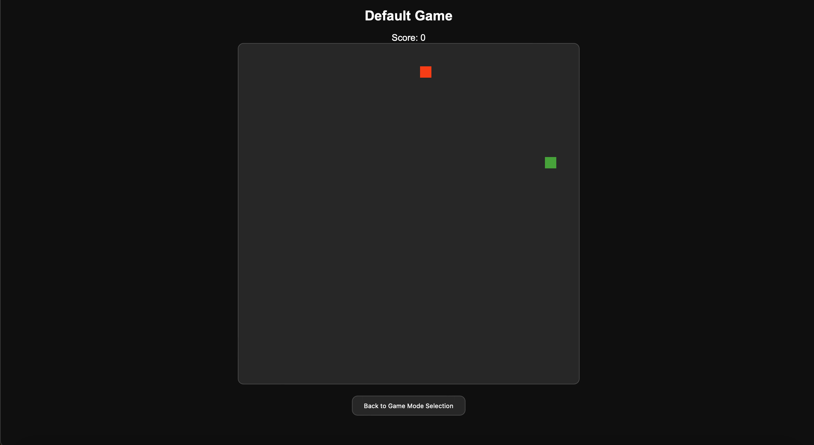

# GitHub Codespaces ♥️ Next.js

Welcome to your shiny new Codespace running Next.js! We've got everything fired up and running for you to explore Next.js.

You've got a blank canvas to work on from a git perspective as well. There's a single initial commit with the what you're seeing right now - where you go from here is up to you!

Everything you do here is contained within this one codespace. There is no repository on GitHub yet. If and when you’re ready you can click "Publish Branch" and we’ll create your repository and push up your project. If you were just exploring then and have no further need for this code then you can simply delete your codespace and it's gone forever.

## Snake Game with Score

This repository contains a basic snake game implementation using React and Next.js. The game includes a scoring feature that tracks the player's score.

### Installation

To run this application, follow these steps:

1. Clone the repository:
   ```bash
   git clone <repository-url>
   cd <repository-directory>
   ```

2. Install the dependencies:
   ```bash
   npm install
   ```

3. Install the new dependency:
   ```bash
   npm install gl-matrix
   ```

4. Run the development server:
   ```bash
   npm run dev
   ```

5. Open your browser and navigate to `http://localhost:3000` to see the application in action.

### Game Modes

The game includes two modes: Default Game and No Borders Game. You can select the game mode on the home page.

### Scoring Feature

The snake game includes a scoring feature that tracks the player's score. The score is incremented by 1 each time the snake eats food. The current score is displayed on the game screen above the game board.

### GPU Acceleration with WebGL

The snake game now utilizes WebGL for GPU acceleration to handle game updates and state management. This integration leverages WebGL shaders for snake movement and collision detection, providing improved performance.

#### How WebGL is Integrated

- The game logic, including snake movement and collision detection, is handled by WebGL shaders executed on the GPU.
- The rendering of the game board and elements is managed by WebGL, leveraging GPU acceleration for improved performance.

#### Running the Game with GPU Acceleration

To run the game with GPU acceleration enabled, follow these steps:

1. Ensure that you have installed the `gl-matrix` dependency as mentioned in the installation instructions.
2. Start the development server:
   ```bash
   npm run dev
   ```
3. Open your browser and navigate to `http://localhost:3000` to see the application in action.

### Contributing

If you would like to contribute to this project, please follow these steps:

1. Fork the repository.
2. Create a new branch for your feature or bugfix.
3. Make your changes and commit them with descriptive messages.
4. Push your changes to your forked repository.
5. Create a pull request to the main repository.


## Demo

